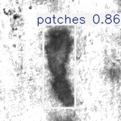

# Industrial Defect Detection with YOLOv8
This repository implements a computer vision pipeline for detecting industrial surface defects using the YOLOv8 object detection framework. The project demonstrates dataset preprocessing, model training, and inference using the NEU Surface Defect Dataset.


## Pipeline

Pascal VOC Annotations → YOLO Annotation Conversion → Model Training → Defect Detection

## Project structure

- `convert_voc_to_yolo.py` - convert Pascal VOC XML labels to YOLO txt labels.
- `train.py` - example training script using `YOLO().train()` on your dataset config.
- `detect.py` - example inference script using a trained YOLO model and saving predictions.
- `pyproject.toml` - dependency and package metadata.

## Requirements

- Python >= 3.13
- Dependencies in `pyproject.toml` (can be installed by pip)

## Setup

```bash
python -m venv .venv
source .venv/bin/activate
pip install -U pip
pip install -e .
```

If you prefer direct install:

```bash
pip install black isort opencv-python tqdm ultralytics
```

## Data preparation

Dataset expected layout (example, YOLO format):

```
dataset/
  images/train/
  labels/train/
  images/val/
  labels/val/
  images/test/
  labels/test/
  dataset.yaml
```

`dataset.yaml` should be a standard Ultralytics dataset config:

```yaml
path: '/path/to/dataset'

train: images/train
val: images/val

names:
  0: crazing
  1: inclusion
  2: patches
  3: pitted_surface
  4: rolled-in_scale
  5: scratches
```

### Convert VOC to YOLO

Edit the paths in `convert_voc_to_yolo.py` and run:

```bash
python convert_voc_to_yolo.py
```

## Training

Edit `train.py` paths for:
- `model = YOLO(...)` weight initialization file or architecture (e.g., `yolov8n.pt`)
- `data=...` dataset yaml path

Run training:

```bash
python train.py
```

Outputs are stored under `runs/detect/train/` by default.

## Inference

Edit `detect.py` paths for:
- `YOLO(...)` model path (e.g., `runs/detect/train/weights/best.pt`)
- `source=...` input image or folder

Run inference:

```bash
python detect.py
```

Results are saved in `runs/detect/prediction` by default.

## Notes

- Adjust `device` (`cpu`, `cuda`, `mps`) based on your hardware.
- Customize hyperparameters in `train.py` as needed.

## Example Result



## License

- This project is licensed under the MIT License (see `LICENSE`).
- Training data comes from NEU Surface Defect Dataset: https://www.kaggle.com/datasets/kaustubhdikshit/neu-surface-defect-database?resource=download
- Dataset copyright and distribution rights are reserved by its owners and are not included in this repository.
